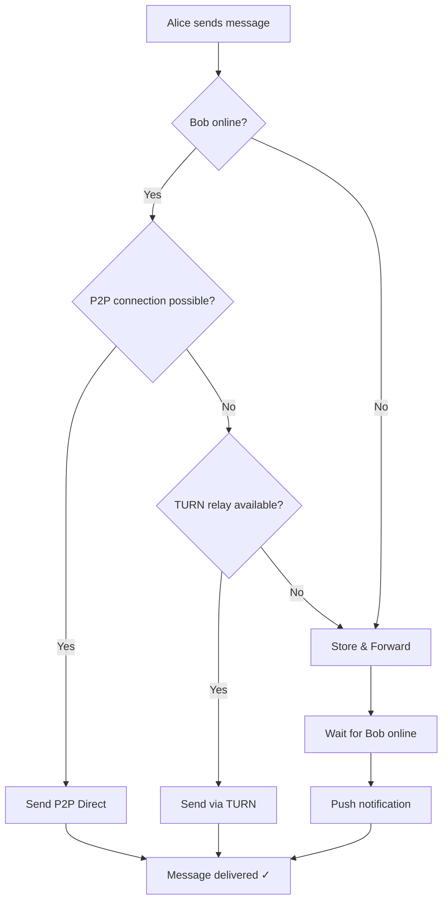

# MePassa Hybrid Architecture

## Overview

MePassa uses a **HYBRID P2P + Server** architecture that combines the best aspects of peer-to-peer communication with the reliability of centralized infrastructure.

## Architecture Philosophy

```
        Privacidade
            ▲
            │
    P2P Puro│
            │              ← Sweet Spot
            │         HÍBRIDO (MePassa)
            │
            │
            │    Centralizado
            │
            └────────────────────▶
                 Usabilidade
```

**MePassa escolhe o "sweet spot":**
- Não sacrifica usabilidade completamente (como P2P puro)
- Não sacrifica privacidade completamente (como centralizado)
- Balanceado para adoção real

## Traffic Distribution

```
┌─────────────────────────────────────────────┐
│                                             │
│  80% das mensagens: P2P direto              │
│  (zero custo, privacidade máxima)           │
│                                             │
│  15% das mensagens: TURN relay              │
│  (NAT simétrico, firewall)                  │
│                                             │
│  5% das mensagens: Store & Forward          │
│  (destinatário offline)                     │
│                                             │
└─────────────────────────────────────────────┘
```

## Three Scenarios

### Scenario A: P2P Direct (80% of cases)

```
[Alice]  ←──── P2P direto ─────→  [Bob]
          (zero custo)
          (privacidade máxima)
```

**When:**
- Both peers online
- NAT allows direct connection
- Discovery via DHT/Bootstrap

**Benefits:**
- Zero server cost
- Maximum privacy (server doesn't see)
- Lowest latency (~50ms)

---

### Scenario B: TURN Relay (15% of cases)

```
[Alice]  ───▶  [TURN]  ───▶  [Bob]
          (relay cego)
          (ainda E2E encrypted)
```

**When:**
- Symmetric NAT
- Restrictive firewall
- P2P direct fails

**Characteristics:**
- Server relays packets blindly
- Still E2E encrypted (server can't read)
- Higher latency (~200ms)
- Server only sees metadata (alice → bob, timestamp, size)

---

### Scenario C: Store & Forward (5% of cases)

```
[Alice]  ───▶  [Store]      [Bob]
     14h          │         (offline)
                  │
                  │         [Bob fica online]
                  └────▶        │
                           18h  ✅
```

**When:**
- Recipient is offline
- Message needs guaranteed delivery

**Characteristics:**
- Server stores encrypted message
- TTL: 14 days
- Auto-delete after delivery
- Push notification when recipient comes online

---

## Decision Flow



## Components

### Client-Side (Device)

- **libp2p**: P2P networking
- **Signal Protocol**: E2E encryption
- **WebRTC**: Voice/video calls
- **SQLite**: Local storage

### Server-Side (Self-hosted)

- **Bootstrap Nodes**: Peer discovery (DHT)
- **TURN Relay**: NAT traversal fallback
- **Message Store**: PostgreSQL + Redis for offline delivery
- **Push Notifications**: FCM/APNs
- **SFU Server**: Group calls (optional)

## Cost Comparison

### Centralizado Puro (WhatsApp model):
```
Bandwidth:   R$ 2.000/mês (100% tráfego passa servidor)
Processing:  R$ 1.500/mês
Storage:     R$ 500/mês
───────────────────────
TOTAL:       R$ 4.000/mês (1000 users)
Per user:    R$ 4,00/mês
```

### Híbrido (MePassa):
```
Bootstrap:   R$ 150/mês (3 VPS pequenos)
TURN:        R$ 250/mês (só 15% uso)
Store:       R$ 150/mês (PostgreSQL + Redis)
Push:        R$ 50/mês
───────────────────────
TOTAL:       R$ 600/mês (1000 users)
Per user:    R$ 0,60/mês

ECONOMIA: 85% 🎯
```

## Privacy & Metadata

### What Server CANNOT See:

- ✅ Message content (E2E encrypted)
- ✅ 80% of message metadata (P2P direct)
- ✅ Sender identity in group messages (Sender Keys)

### What Server CAN See (20% via relay/store):

- ⚠️ alice → bob (sender and recipient)
- ⚠️ Timestamp
- ⚠️ Message size
- ⚠️ IP addresses (relay scenario)

**Comparison:**
- WhatsApp: Server sees 100% metadata
- MePassa: Server sees ~20% metadata
- Briar (P2P pure): Server sees 0% but doesn't work offline

## Trade-offs

### vs Pure P2P (Briar, Jami, Tox):

**MePassa sacrifices:**
- ❌ 100% metadata privacy (only 80%)

**MePassa gains:**
- ✅ Works offline (store-and-forward)
- ✅ 100% NAT traversal success
- ✅ Fast discovery
- ✅ Better UX
- ✅ Real adoption potential

### vs Centralized (WhatsApp, Telegram):

**MePassa sacrifices:**
- ❌ Some UX conveniences (server features)

**MePassa gains:**
- ✅ 80% better privacy (P2P direct)
- ✅ 85% lower cost
- ✅ Self-hosting possible
- ✅ LGPD compliance easier
- ✅ Censorship resistant

## Key Principles

1. **Always try P2P first**
   - Maximize privacy and minimize cost
   - Fall back to server only when necessary

2. **E2E Encryption everywhere**
   - Even relay traffic is encrypted
   - Server can never read content

3. **Minimal metadata collection**
   - Only what's strictly necessary
   - Auto-delete after TTL

4. **User doesn't care about P2P**
   - User wants messages to arrive
   - Architecture is transparent
   - "It just works"

## Why Not 100% P2P?

**Physics and Reality:**

1. **NAT Simétrico**: ~20% of users can't do direct P2P
2. **Offline Delivery**: Messages need to be stored somewhere
3. **Discovery**: Needs bootstrap nodes
4. **Push Notifications**: Require server coordination
5. **Group Calls**: Require SFU for >4 participants

**Conclusion:** Hybrid is the only realistic architecture for mass adoption.

## References

- [Comparação de Arquiteturas](../../documentos/start/mepassa_comparacao_arquiteturas.md)
- [Arquitetura Híbrida Detalhada](../../documentos/start/mepassa_arquitetura_hibrida.md)
- [libp2p Documentation](https://docs.libp2p.io)
- [Signal Protocol Specifications](https://signal.org/docs/)

---

**Next:** [Core Components](02-core-components.md)
